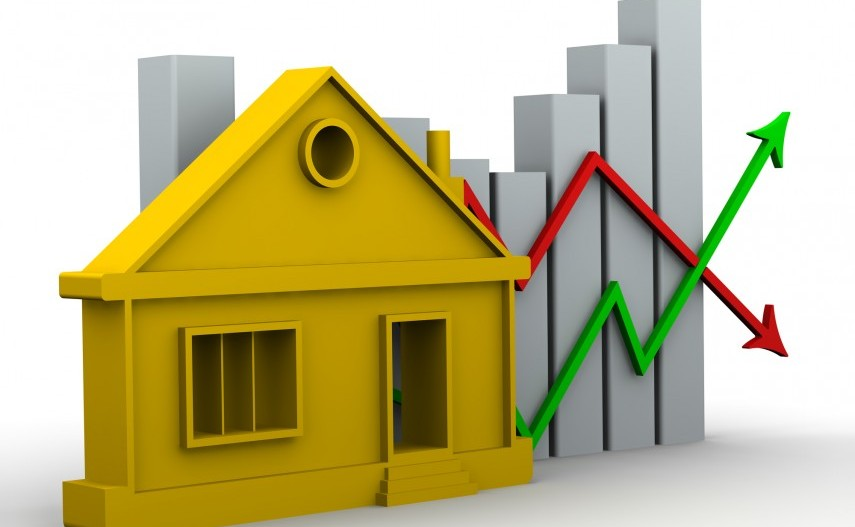

# Project Description

The scope of this project is to review United States’ housing data since the housing market collapsed in 2008 and identify how the market has or has not rebounded between then and 2019. 
Key things we will analyze nationally and by state may include but are not limited to the following: 

* Median sales prices for homes and foreclosure resales
* The top five states where median sales prices increased and top five states where prices decreased
* Consumer/market variables that may affect the median sales prices
* What future prices may look like based on these consumer/market variables 

The purpose of this analysis is to provide homeowners a tool that allows them to see how the housing market has changed since 2008, how certain consumer/market factors affect prices, and what prices may look like in the future. 

## Research Questions to Answer
* How have the average median house sales and foreclosure resale rates trended since 2008? 
* What are the top five states with the highest increases and highest decrease in median house prices since 2008?
* What consumer/market variables affected median sales prices for homes since 2008?
* Based on the results of Question 3, what may future median sales prices look like? 

## Datasets to Be Used
* Zillow Housing Data
  https://www.zillow.com/research/data/

* Household Debt Statistics by State (1999-2018)
  https://www.newyorkfed.org/microeconomics/databank.html

* State-Level Debt-to-Income Ratio, 1999 - 2018
  https://www.federalreserve.gov/releases/z1/dataviz/household_debt/state/map/#year:2018

* Employment and Unemployment Data
  https://data.bls.gov/timeseries/LNS14000000

* Divorce Rates by State 1999 - 2018
  https://www.cdc.gov/nchs/nvss/marriage-divorce.htm#state_tables

* Median Household Income by State 1984 - 2018
  https://www.census.gov/data/tables/time-series/demo/income-poverty/historical-income-households.html

